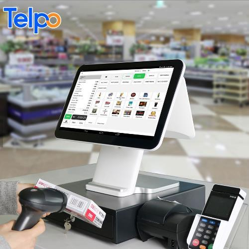

Requirement specification
========
## Introduction
1. Project name
2. Purpose
3. Intended audience
4. User needs 
5. Project outline 
6. current situation 
7. Goal  
8. Glossary
9. other requirements

__Project name__
the project name is the cashier machine: 

__purpose__

The purpose of this document is to build a cashier machine for store that reduces the cost of bookkeeping and labor, simplify the processing and flow of large amounts of information,easy to manage transaction and products.
The cashier machine actually can do a lot of stuff for the user(saleman) : 
* Fast Checkouts. Cash registers will ensure that the checkout stage of your business is as fast and seamless as possible. ...
* Increase Security. Cash registers can improve the security on your shop floor.The cash drawers will be securely locked until a successful sales transaction is put through.
* Cash registers prevent the need to keep money out in view of the public. 
* Multiple Payment Options.you will need to be able to accept all the payment options(card,cash).
* Audit Reports : Cash registers will record detailed information about each sales transaction.

__Intended audience__

This is aimed at the store staff,people who often need to collect money and give back changes,and also,this project can be accessed by developers, project managers, testers, sales and marketing people or stakeholders in other departments.

__User needs__

the users might not only be the salesmen but it can also be used by other developers who may need the application to whether check it or update...so i think for this reason our code should have comments in which we will explain how we get the work done.

__Project outline__

The project will include mainly two parts backend and frontend, the backend will be consist of c# and MYsql and also for data processing,otherside,database for storing product or user information.

__current situation__

for now we have a plan of making cashier machine application,and we almost have everything(ideas) to start it off.

__Goal__

One of the goal is to know how to be a part of a team in the software industry, through some controlling tools like git, GitHub, and gitLab, also to get to use the task manager websites like Trello.com, and spread the tasks for each member of the team.

__Glossary__

 C# : is a general-purpose, procedural computer programming language supporting structured programming.
 Mysql : s an open-source relational database management system.

__other requirements__

in this project we will be mainly working on these things : 
* Performance : how the app reacts to the user’s requests.
* Safety.
* Security :  the way the app protects information.
* Quality.
* Availability : how the app operates and functions.
